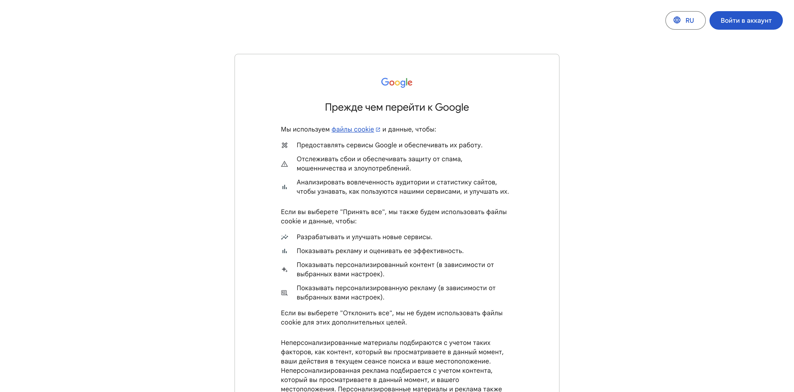

# Google_Maps_Data_Extractor

Описание проекта

Простой парсер Google Maps, написанный на Python, который позволяет автоматически собирать основные данные заведений (название, рейтинг, адрес, число отзывов) по указанному поисковому запросу и сохранять результаты в Excel.

Проект демонстрирует:

Модульную архитектуру (WebDriver, DataExtractor, ExcelExporter, Utils).

Конфигурируемый запуск через main.py с флагами командной строки.

Обработку динамических элементов (ожидания, клик по баннеру куки).

Экспорт данных в удобный формат (.xlsx).

Требования

Python 3.8+

Google Chrome

ChromeDriver (версия совпадающая с Google Chrome)

Установка

Клонируйте репозиторий:

git clone https://github.com/<ваш_никнейм>/google-maps-parser.git
cd google-maps-parser

Создайте виртуальное окружение и активируйте его:

python3 -m venv venv
source venv/bin/activate   # macOS/Linux
venv\Scripts\activate     # Windows

Установите зависимости:

pip install -r requirements.txt

Пример запуска

python3 main.py \
  --query "кафе Ларнака" \
  --driver_path /путь/к/chromedriver \
  --chrome_path "/Applications/Google Chrome.app/Contents/MacOS/Google Chrome" \
  --max_results 5 \
  --output results.xlsx

После выполнения скрипта будет создан файл results.xlsx с таблицей результатов.

Скриншоты и GIF

screenshots/before_search.png — начальный экран с баннером куки.

screenshots/after_search.png — результаты поиска по запросу.

screenshots/demo.gif — анимация работы парсера.